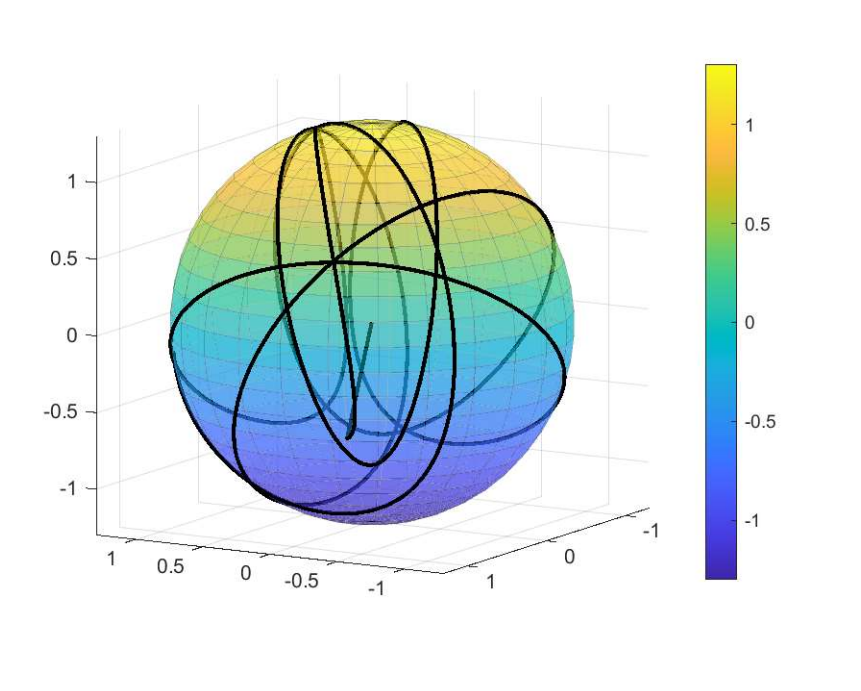

---

##### Download

- [Term Paper](paper1.pdf)
- [Presentation slides](presentation1.pdf)
- [Bachleors Thesis](BTP_Phase_1report.pdf) – BTP Report Phase 1.

---

##### Abstract

The study of vibrating systems, particularly those equipped with geometrically consistent tuned
mass dampers (GTMDs), plays a crucial role in understanding structural behavior and resilience
against external forces. This research delves into the challenging domain of estimating parameters and states of vibrating structures adorned with GTMDs with precision. The application of
dynamical systems in contemporary engineering necessitates a sophisticated modeling approach,
especially when dealing with the complexities of structures on Riemannian manifolds. This paper
introduces Kalman filters as a foundational tool for parameter and state estimation on Riemannian
manifolds, particularly within the context of Lie Algebra. The research aims to bridge existing gaps
in the literature related to parameter and state estimation in the context of vibrating structures
with GTMDs.

---

##### Figure 1: Trajectory of Chaotic Pendulum on SO(3) Manifold



---

<!-- ##### Citation

Author. Year. "Title." _Journal_ Volume (Issue): First page–Last page. https://doi.org/paper_doi.

```BibTeX
@article{AAYY,
author = {Author},
doi = {paper_doi},
journal = {Journal},
number = {Issue},
pages = {XXX--YYY},
title ={Title},
volume = {Volume},
year = {Year}}
```
--- -->


