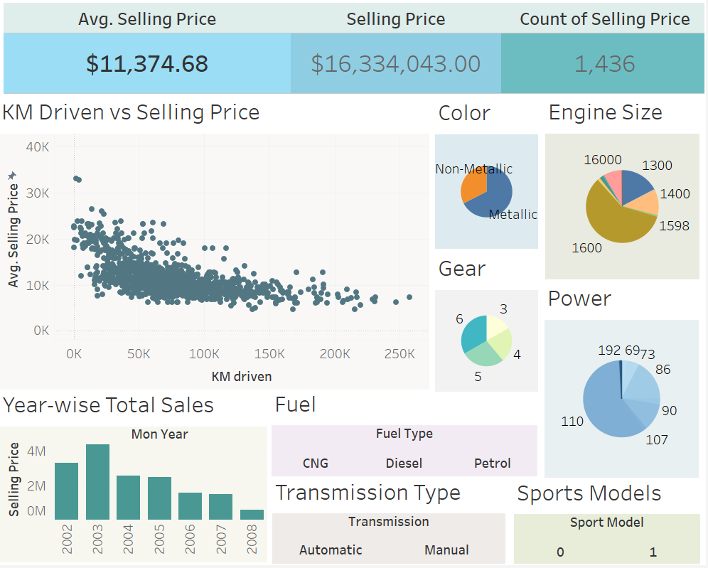

---

##### Download

- [Presentation](presentation2.pdf)
- [Code and data](https://github.com/Roshan818/PicklAI)

---

##### Abstract

In TransOrg Analytics as Data Analyst Intern , I was responsicle for analysing Client's data, and come up with predictions, trendes and other strategies to improve theor business, For the Sme, I have looked into the data of cars in India, and came up with a model to predict the price of cars in India. The model was built using XG-Boost. Besides that I used Tableau For Data Visualization and SQL for Data Manipulation.

---

##### Figure X: Figure caption



---

<!-- ##### Citation

Author 1 and Author 2. Year. "Title." _Journal_ Volume (Issue): First page–Last page. https://doi.org/paper_doi.

```BibTeX
@article{AAYY,
author = {Author 1 and Author 2},
doi = {paper_doi},
journal = {Journal},
number = {Issue},
pages = {XXX--YYY},
title ={Title},
volume = {Volume},
year = {Year}}
```

--- -->

##### Related material

- [Presentation slides](presentation2.pdf)
