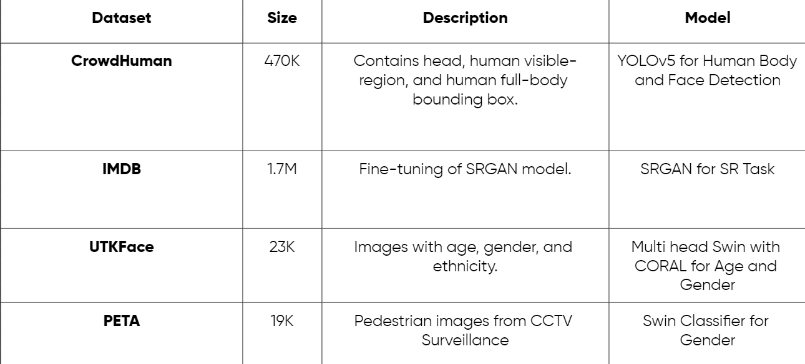
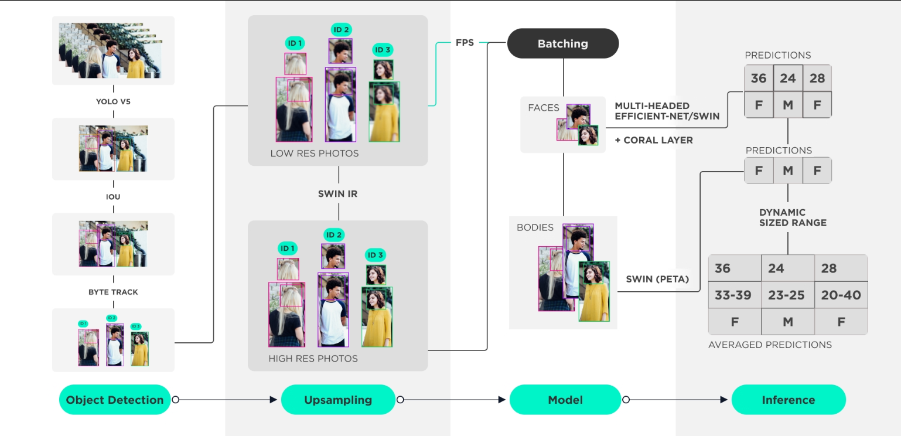

## Age \& Gender Detection through low quality CCTV footage

The task of this project is to estimate people's age and gender form a surveillance video.


##### Download

- [Presentation slides](MP_BO_T11.pdf)
- [Code](https://github.com/Roshan818/Age_and_Gender_Detection_through_CCTV_Videos)
- [User Manual](MP_BO_T11_UM.pdf)

---

## Objectives

The task appears simple but there are number of issues that must be taken into consideration inorder to develop an efficient system. Through this system we aim to achieve the following objectives:

- The system must use maximum information. It must use both face and body as well as information from all the frames inorder to estimate the age and gender.
- The system must have a good FPS rate so that it could be used in real time.
- The results must be usable and interpretable.

---

## Methodology

Following approach was used to build the desired system.

- **Object Detection**: The first task was to detect humans in the indiviual frame. YOLO was used for this purpose. It is the SOTA algorithm used for multi-object detection task which gives high accuracy even when applied in real-time on videos.
- **Tracker**: After detecting the person in a frame it is necessary to track that person throughout the frame. Byte Tracker was used for this purpose. It is the SOTA algorithm for multi-object tracking.
- **Upscaling**: Surveillance video usually have a low quality making it difficult to identify the person's face. To overcome this issue upscaling of face and body images extracted from the video was needed. SwinIR was used for this purpose. This task can be skipped to increase the fps of the system.
- **Models**: SWIN Transformer was used as a backbone to predict both age and gender of a person. The diagram of the backbone is given below.


- **Dataset**: Details of the dataset that were used to train the model are given below



- **Inference**: To improve predictions, we applied two techniques at the time of inference:

1. To get the gender information accross frames, we took the mode of the gender predictions from all the frames, as our final output
2. To get better age windows, we dynamically allocated the age windows, based on the confidence of the prediction of Coral Layer

---

## Pipeline



---

## User Guide

**Setting Up**

```
conda create -f environment.yml
conda activate ByteTrack

# On Linux

pip install cython
pip install cython-bbox

# On Windows(not-recommended)

pip install cython
pip install -e git+https://github.com/samson-wang/cython_bbox.git#egg=cython-bbox

# if you face an error in lap pip install

conda install -c conda-forge lap
```

**Inference Script**

```
python pipeline.py <video_path>
#or
python pipeline.py <image_path>

!csv outputs are saved with the same name as image/video name in ./outputs
```

**Required Arguments**

```
<video_path>/<image_path>
Supported Formats
* For video: .aGi .mp4 .webm .mkG .moF
* For image: .jpeg .jpg .png .gif
```

**Options**

`--save ` : Save the annotated video/image in output directory, i.e. outputs

`--display` : View the annotated Gideo/image in real-time

`--hrvid` : Apply upscaling on detected faces (only for video input)

**Example Usages**

```
pythonpipeline.py demo_images/sample.jpg
demo_images/sample.jpg --display # displays annotated image in opencv window
demo_vids/video.mp4 --save # saves annotated video in ./outputs
demo_Gids/video.mp4 --display --hrvid # applies upscaling and displays
```

---

## Results

To build an efficient system we have trained the datasets on various models. Models and it's performance are given below.


From the table it is visible that **Multi-Head Swin + Coral(trained on the outputs of SwinIR)** outperformed other models

---
