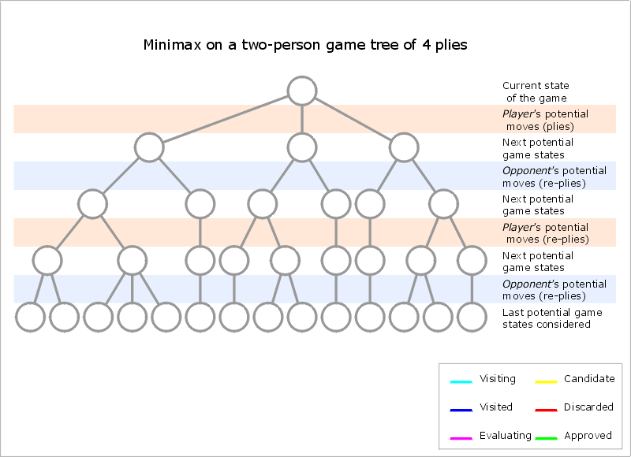

## Chess Engine

<!-- - [Presentation slides](MP_BO_T11.pdf) -->

> [Code](https://github.com/Roshan818/ChessEngine)

---

<!-- - [User Manual](MP_BO_T11_UM.pdf) -->


Traditional chess engines leverage classical artificial intelligence techniques, employing algorithms such as Minimax, Negamax, and Alpha-Beta Pruning. These engines operate on a deterministic, exhaustive search approach, utilizing a predefined heuristic for position evaluation, exploring the game tree to a specified depth, and making decisions based on minimizing potential losses and maximizing gains. While highly effective and well-established, these engines differ fundamentally from neural network-based engines like ChessCoach, which incorporate machine learning for complex, non-linear evaluations.

---

## Chess Engine Implementation

1. **Board Representation:**
   
   The engine represents the board as a 2D array of integers, with each integer representing a piece. The engine uses the following integer values to represent pieces:

   - **White Pieces:** 1-6
   - **Black Pieces:** -1 to -6
   - **Empty Squares:** 0

2. **Move Generation:**

The engine generates moves for a given position by iterating through the board and generating moves for each piece. It uses the following functions to generate moves for each piece:

   <!-- ```python
   # =========================================================== Species Moves ============================================================

    # -------------------------------------------------------- Pawn Moves --------------------------------------------------------

    def getPawnMoves(self, r, c, moves):
        # Get all pawn moves for the pawn located at row, col and add these moves to the list
        piecePinned = False
        pinDirection = ()

        for i in range(len(self.pins) - 1, -1, -1):
            if self.pins[i][0] == r and self.pins[i][1] == c:
                piecePinned = True
                pinDirection = (self.pins[i][2], self.pins[i][3])
                self.pins.remove(self.pins[i])
                break

        if self.whiteToMove:
            moveAmount = -1
            startRow = 6
            backRow = 0
            enemyColor = 'b'
            kingRow, kingCol = self.whiteKingLocation

        else:
            moveAmount = 1
            startRow = 1
            backRow = 7
            enemyColor = 'w'
            kingRow, kingCol = self.blackKingLocation

        pawnPromotion = False

        if self.board[r + moveAmount][c] == '--':  # 1 square move
            if not piecePinned or pinDirection == (moveAmount, 0):
                if r + moveAmount == backRow:  # if piece gets to back rank then it is a pawn promotion
                    pawnPromotion = True
                moves.append(Move((r, c), (r + moveAmount, c),
                             self.board, pawnPromotion=pawnPromotion))

                # 2 square moves
                if r == startRow and self.board[r + 2 * moveAmount][c] == '--':
                    moves.append(
                        Move((r, c), (r + 2 * moveAmount, c), self.board))

        if c - 1 >= 0:  # Capture to left
            if not piecePinned or pinDirection == (moveAmount, -1):
                if self.board[r + moveAmount][c - 1][0] == enemyColor:
                    if r + moveAmount == backRow:  # if piece gets to back rank then it is a pawn promotion
                        pawnPromotion = True
                    moves.append(Move((r, c), (r + moveAmount, c - 1),
                                 self.board, pawnPromotion=pawnPromotion))

                if (r + moveAmount, c - 1) == self.enpassantPossible:
                    attackingPiece = blockingPiece = False
                    if kingRow == r:  # Solving the weird enpassant bug
                        if kingCol < c:  # king is on the left of the pawn
                            # inside range between the king and the pawn; outside range between pawn border
                            insideRange = range(kingCol + 1, c - 1)
                            outsideRange = range(c + 1, 8)
                        else:  # King right of pawn
                            insideRange = range(kingCol - 1, c, -1)
                            outsideRange = range(c - 2, -1, -1)

                        for i in insideRange:
                            # Some other piece beside enpassant pawn blocks
                            if self.board[r][i] != '--':
                                blockingPiece = True
                        for i in outsideRange:
                            square = self.board[r][i]
                            # Attacking Piece
                            if square[0] == enemyColor and (square[1] == 'R' or square[1] == 'Q'):
                                attackingPiece = True
                            elif square != '--':
                                blockingPiece = True
                    if not attackingPiece or blockingPiece:
                        moves.append(
                            Move((r, c), (r + moveAmount, c - 1), self.board, enPassant=True))

        if c + 1 <= 7:  # Capture to right
            if not piecePinned or pinDirection == (moveAmount, 1):
                if self.board[r + moveAmount][c + 1][0] == enemyColor:
                    if r + moveAmount == backRow:  # if piece gets to back rank then it is a pawn promotion
                        pawnPromotion = True
                    moves.append(Move((r, c), (r + moveAmount, c + 1),
                                 self.board, pawnPromotion=pawnPromotion))

                if (r + moveAmount, c + 1) == self.enpassantPossible:
                    attackingPiece = blockingPiece = False
                    if kingRow == r:  # Solving the weird enpassant bug
                        if kingCol < c:  # king is on the left of the pawn
                            # inside range between the king and the pawn; outside range between pawn border
                            insideRange = range(kingCol + 1, c)
                            outsideRange = range(c + 2, 8)
                        else:  # King right of pawn
                            insideRange = range(kingCol - 1, c + 1, -1)
                            outsideRange = range(c - 1, -1, -1)

                        for i in insideRange:
                            # Some other piece beside enpassant pawn blocks
                            if self.board[r][i] != '--':
                                blockingPiece = True
                        for i in outsideRange:
                            square = self.board[r][i]
                            # Attacking Piece
                            if square[0] == enemyColor and (square[1] == 'R' or square[1] == 'Q'):
                                attackingPiece = True
                            elif square != '--':
                                blockingPiece = True
                    if not attackingPiece or blockingPiece:
                        moves.append(
                            Move((r, c), (r + moveAmount, c + 1), self.board, enPassant=True))

    # -------------------------------------------------------- Rook Moves --------------------------------------------------------

    def getRookMoves(self, r, c, moves):
        # Get all Rook moves for the Rook located at row, col and add these moves to the list
        piecePinned = False
        pinDirection = ()

        for i in range(len(self.pins) - 1, -1, -1):
            if self.pins[i][0] == r and self.pins[i][1] == c:
                piecePinned = True
                pinDirection = (self.pins[i][2], self.pins[i][3])
                if self.board[r][c][1] != 'Q':  # Cant remove queen from pin on rook moves,
                    # only remove it on bishop moves
                    self.pins.remove(self.pins[i])
                break

        # Up , Left, Down, Right
        directions = ((-1, 0), (0, -1), (1, 0), (0, 1))
        enemyColor = 'b' if self.whiteToMove else 'w'
        for d in directions:
            for i in range(1, 8):
                endRow = r + d[0] * i
                endCol = c + d[1] * i
                if 0 <= endRow < 8 and 0 <= endCol < 8:  # On board
                    if not piecePinned or pinDirection == d or pinDirection == (-d[0], -d[1]):
                        endPiece = self.board[endRow][endCol]
                        if endPiece == '--':  # Empty space valid
                            moves.append(
                                Move((r, c), (endRow, endCol), self.board))
                        elif endPiece[0] == enemyColor:  # Enemy piece valid
                            moves.append(
                                Move((r, c), (endRow, endCol), self.board))
                            break

                        else:  # Friendly piece invalid
                            break
                else:  # Off board
                    break

    # -------------------------------------------------------- Bishop Moves --------------------------------------------------------
    def getBishopMoves(self, r, c, moves):
        # Get all Bishop moves for the Bishop located at row, col and add these moves to the list
        piecePinned = False
        pinDirection = ()

        for i in range(len(self.pins) - 1, -1, -1):
            if self.pins[i][0] == r and self.pins[i][1] == c:
                piecePinned = True
                pinDirection = (self.pins[i][2], self.pins[i][3])
                self.pins.remove(self.pins[i])
                break

        directions = ((-1, -1), (1, 1), (1, -1), (-1, 1))  # 4 diaganols
        enemyColor = 'b' if self.whiteToMove else 'w'
        for d in directions:
            for i in range(1, 8):  # Can move maximumly 7 squares
                endRow = r + d[0] * i
                endCol = c + d[1] * i
                if 0 <= endRow < 8 and 0 <= endCol < 8:  # Is the end-point on the board?
                    if not piecePinned or pinDirection == d or pinDirection == (-d[0], -d[1]):
                        endPiece = self.board[endRow][endCol]
                        if endPiece == '--':  # Empty Space Valid
                            moves.append(
                                Move((r, c), (endRow, endCol), self.board))
                        elif endPiece[0] == enemyColor:  # Enemy color Valid
                            moves.append(
                                Move((r, c), (endRow, endCol), self.board))
                            break
                        else:  # Friendly Piece Invalid
                            break
                else:  # Off Board
                    break

    # -------------------------------------------------------- Knight Moves --------------------------------------------------------
    def getKnightMoves(self, r, c, moves):
        # Get all Knight moves for the Knight located at row, col and add these moves to the list
        piecePinned = False
        for i in range(len(self.pins) - 1, -1, -1):
            if self.pins[i][0] == r and self.pins[i][1] == c:
                piecePinned = True
                self.pins.remove(self.pins[i])
                break

        knightMoves = ((-2, -1), (-2, 1), (2, -1), (2, 1),
                       (1, 2), (1, -2), (-1, 2), (-1, -2))
        allyColor = 'w' if self.whiteToMove else 'b'
        for m in knightMoves:
            endRow = r + m[0]
            endCol = c + m[1]
            if 0 <= endRow < 8 and 0 <= endCol < 8:
                if not piecePinned:
                    endPiece = self.board[endRow][endCol]
                    # Not an ally piece (empty or enemy piece)
                    if endPiece[0] != allyColor:
                        moves.append(
                            Move((r, c), (endRow, endCol), self.board))

    # -------------------------------------------------------- King Moves --------------------------------------------------------
    def getKingMoves(self, r, c, moves):
        # Get all King moves for the King located at row, col and add these moves to the list
        kingMoves = ((0, 1), (0, -1), (1, 0), (-1, 0),
                     (-1, 1), (-1, -1), (1, 1), (1, -1))
        allyColor = 'w' if self.whiteToMove else 'b'
        for i in range(8):
            endRow = r + kingMoves[i][0]
            endCol = c + kingMoves[i][1]
            if 0 <= endRow < 8 and 0 <= endCol < 8:  # Target place on the board
                endPiece = self.board[endRow][endCol]

                if endPiece[0] != allyColor:    # Target place either empty or enemy on it
                    # Place king on target square and check for checks
                    if allyColor == 'w':
                        self.whiteKingLocation = (endRow, endCol)
                    else:
                        self.blackKingLocation = (endRow, endCol)
                    inCheck, pins, checks, ally = self.checkForPinsAndChecks()

                    if not inCheck:
                        moves.append(
                            Move((r, c), (endRow, endCol), self.board))

                    # Place king back on its own location
                    if allyColor == 'w':
                        self.whiteKingLocation = (r, c)
                    else:
                        self.blackKingLocation = (r, c)

    # -------------------------------------------------------- Queen Moves --------------------------------------------------------
    def getQueenMoves(self, r, c, moves):
        # Get all Queen moves for the Queen located at row, col and add these moves to the list
        # Queen moves is the combination of bishop & rook
        self.getRookMoves(r, c, moves)
        self.getBishopMoves(r, c, moves)

    # ======================================================= Castle Moves ===============================================================
    # Generate all valid castle moves for the king at (r,c) and add them to the list of moves

    def getCastleMoves(self, r, c, moves, allyColor):
        if self.squareUnderAttack(r, c):
            return  # Can't castle while we are in check!
        if (self.whiteToMove and self.currentCastlingRight.wks) or (not self.whiteToMove and self.currentCastlingRight.bks):
            self.getKingsideCastleMoves(r, c, moves, allyColor)

        if (self.whiteToMove and self.currentCastlingRight.wqs) or (not self.whiteToMove and self.currentCastlingRight.bqs):
            self.getQueensideCastleMoves(r, c, moves, allyColor)

    def getKingsideCastleMoves(self, r, c, moves, allyColor):
        if self.board[r][c + 1] == '--' and self.board[r][c + 2] == '--':
            if not self.squareUnderAttack(r, c + 1) and not self.squareUnderAttack(r, c + 2):
                moves.append(
                    Move((r, c), (r, c + 2), self.board, isCastleMove=True))
            pass

    def getQueensideCastleMoves(self, r, c, moves, allyColor):
        if self.board[r][c - 1] == '--' and self.board[r][c - 2] == '--' and self.board[r][c - 3] == '--':
            if not self.squareUnderAttack(r, c - 1) and not self.squareUnderAttack(r, c - 2):
                moves.append(
                    Move((r, c), (r, c - 2), self.board, isCastleMove=True))
   ``` -->

3. **Move Validation:**
   The engine validates moves by generating all possible moves for the current position and checking if the move is in the list of possible moves.

   <!-- ```python
   def getValidMoves(self):
        # All moves considering checks
        moves = []
        self.inCheck, self.pins, self.checks, ally = self.checkForPinsAndChecks()
        if self.whiteToMove:
            kingRow = self.whiteKingLocation[0]
            kingCol = self.whiteKingLocation[1]
        else:
            kingRow = self.blackKingLocation[0]
            kingCol = self.blackKingLocation[1]

        if self.inCheck:
            if len(self.checks) == 1:  # Only 1 check ; block check or move king
                moves = self.getAllPossibleMoves()

                # To block a check you must move a piece in one of the squares
                # between the enemy and the king
                check = self.checks[0]  # Check info
                checkRow = check[0]
                checkCol = check[1]
                # Enemy piece causing the check
                pieceChecking = self.board[checkRow][checkCol]
                # If the checking enemy is knight the only valid move is capturing the knight
                if pieceChecking[1] == 'N':
                    validSquares = [(checkRow, checkCol)]
                else:
                    validSquares = []
                    for i in range(1, 8):
                        # Check 2 and 3 are the check directions
                        validSquare = (
                            kingRow + check[2] * i, kingCol + check[3] * i)
                        validSquares.append(validSquare)
                        # Once you get to the enemy piece checking
                        if validSquare[0] == checkRow and validSquare[1] == checkCol:
                            break

                # Get rid of any moves tht dont block check. And/or move the king
                for i in range(len(moves) - 1, -1, -1):
                    # Move doesnt move king so it must block or capture
                    if moves[i].pieceMoved[1] != 'K':
                        # The move wont block check or capture the checking piece enemy
                        if not (moves[i].endRow, moves[i].endCol) in validSquares:
                            moves.remove(moves[i])

            else:  # Double Checks! King MUST move.
                self.getKingMoves(kingRow, kingCol, moves)

        else:  # Not in check, so all moves are fine!
            moves = self.getAllPossibleMoves()

        # ------------- Check / Stale Mate -------------------------------

        if len(moves) == 0:  # Either checkmate or stalemate
            if self.inCheck:
                self.checkmate = True
            else:
                self.stalemate = True
        else:
            self.checkmate = False
            self.stalemate = False

        # ------------- Get Castle Moves ---------------------------------
        self.getCastleMoves(kingRow, kingCol, moves,
                            'w' if self.whiteToMove else 'b')

        return moves
    ``` -->

4. **Position Evaluation:**
   It will check for threats, pins and checks.

5. **Move Selection:**
   We have made options to select from the following algorithms:
   a. Random
   b. Minimax
   c. Negamax
   d. Alpha-Beta Pruning

---

## Chess Engine Evaluation

1. **Minimax Algorithm:**
   
   The Minimax algorithm, a decision-making strategy in two-player games like chess, aims to minimize potential losses for a worst-case scenario while maximizing gains. The engine explores a game tree, considering all possible moves for both players up to a certain depth.

   - **Evaluation Function:** At the leaves of the game tree, an evaluation function assesses the desirability of a position, assigning a numerical value indicating its favorability for the side to move.

   - **Depth Search:** The engine conducts a depth-first search, reaching a specified depth in the game tree before evaluating positions. The search is exhaustive, considering all possible move sequences up to the specified depth.

   - **Backtracking:** After evaluating a position, the engine backtracks to the previous position and explores the next possible move. It repeats this process until it reaches the specified depth.

2. **Negamax Algorithm:**
   
   Negamax optimizes Minimax, simplifying implementation and reducing code complexity. It capitalizes on the fact that in two-player zero-sum games like chess, the evaluation of a position for one player is the negation of the evaluation for the other.

   - **Simplified Minimax:** Negamax combines the roles of maximizing and minimizing players into a single recursive function, reducing redundancy and improving code conciseness.

3. **Alpha-Beta Pruning:**
   
   Alpha-Beta Pruning optimizes Minimax and Negamax by eliminating the evaluation of irrelevant branches in the game tree.

   - **Branch Elimination:** As the engine traverses the game tree, it maintains alpha and beta values, representing the minimum score for the maximizing player and the maximum score for the minimizing player. If a branch's score won't affect the final result, it prunes that branch, saving computational resources.

   - **Efficiency Improvement:** Alpha-Beta Pruning significantly reduces the number of nodes evaluated, enabling deeper exploration of the game tree within the same time constraints.

---
